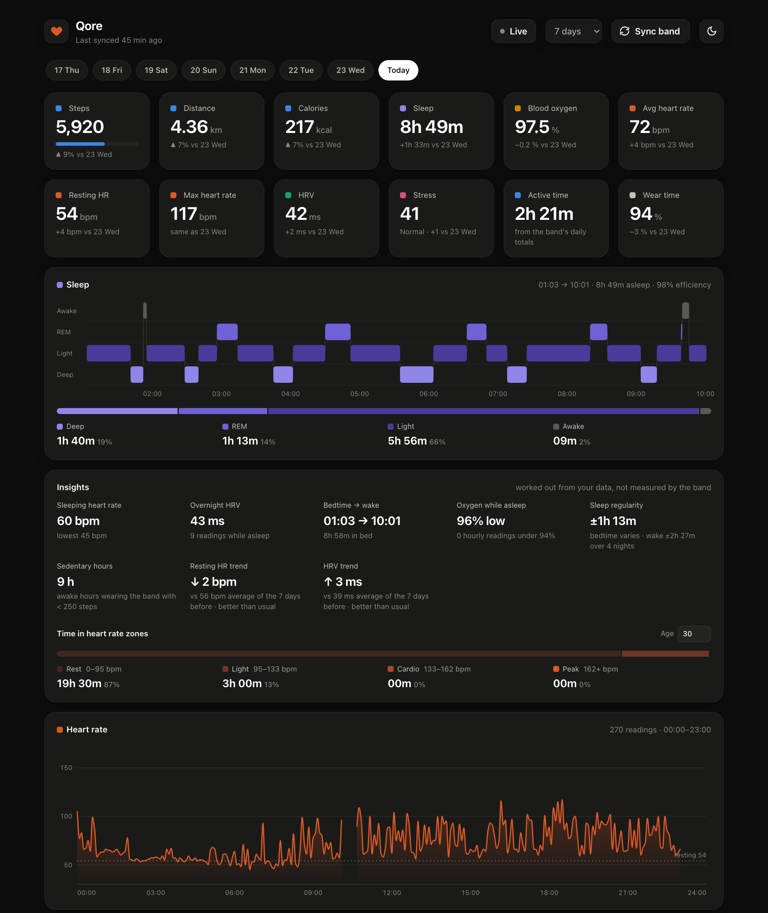
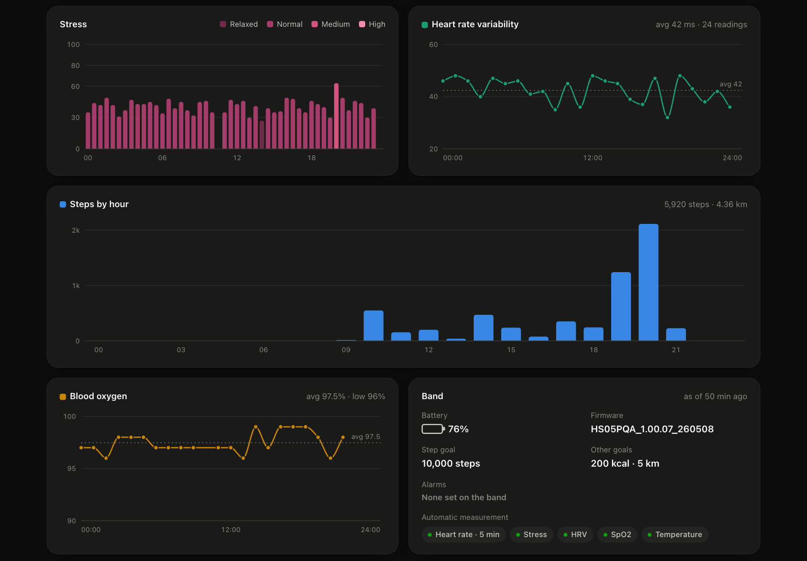
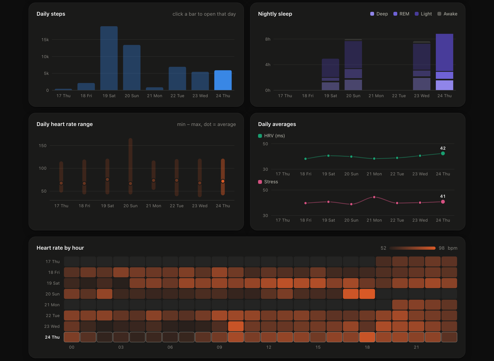

# qore-smartwatch data & dashboard

I have a Pebble Qore band. The app is fine, but all my heart rate, sleep and stress data ends up on someone else's server. Why would I hand that to a third party when the band will just tell my laptop everything over Bluetooth?

So this pulls the data straight off the band and shows it in a dashboard that runs on your own machine. Nothing leaves your computer.



## What it gets

Heart rate (every 5 min), steps, calories, distance, stress, HRV, blood oxygen, sleep stages, battery, goals and alarms. You can also trigger a live heart rate / SpO2 / stress / health check reading from the dashboard.

The band talks the same protocol as the Colmi / QRing rings. I've only tried the Qore tho.

Per day: stress, HRV, steps by hour, blood oxygen, and what the band itself reports.



And the week at a glance, plus heart rate by hour for every day.



## Setup

```sh
python3 -m venv .venv
.venv/bin/pip install -r requirements.txt
cp .env.example .env
```

Putting your band's address in `.env` is optional. It just skips the scan. Run `python watch.py scan` to find it.

Close the Pebble app (or turn off Bluetooth on your phone) first. The band only takes one connection at a time.

## Use it

```sh
.venv/bin/python watch.py export --days 7    # pull the last week into data/
.venv/bin/python dashboard.py --open         # opens http://127.0.0.1:8765
```

There's a sync button in the dashboard too, so after the first run you mostly just leave that open.

Everything gets saved to `data/qore.db` (SQLite) plus a CSV per table, so you can poke at it however you want.

`watch.py` has a bunch of other commands (`sleep`, `stress`, `hrv`, `spo2`, `measure`, `probe`, ...). `python watch.py -h` lists them all.

## Heads up

Syncing sets the band's clock, same as the official app does. The band files every reading under whatever date it thinks it is, so a wrong clock means misdated data.
